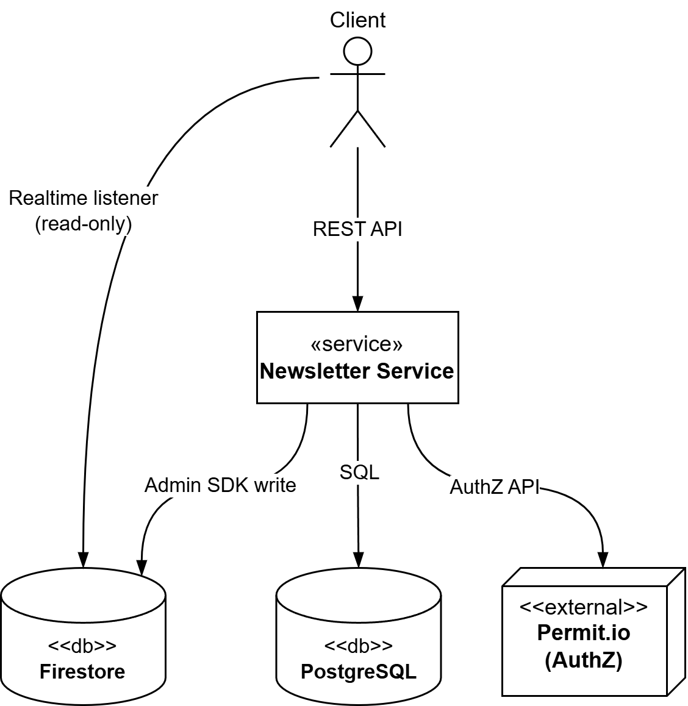

# Newsletter application

This service keeps full control of your data and security checks, while offloading real-time and push infrastructure to Firebase’s managed platform.

### Key Components

- **Newsletter Service**  
  Your Go‐based backend:
    - Exposes REST endpoints for posting, subscribing, etc.
    - Persists canonical data in **PostgreSQL** (ACID, relational guarantees).
    - Authorizes every request via **Permit.io** (no accidental bypasses).

- **Firestore (Realtime Reads)**  
  After saving to Postgres, the service uses the Firebase Admin SDK to write a lightweight copy into Firestore.
    - Clients open read-only listeners against Firestore streams for live updates.
    - Never exposed for writes—prevents rogue or unauthorized data changes.

- **Firebase Cloud Messaging (Push Notifications)**  
  Whenever a new post or subscription event occurs, the service sends an FCM push to subscribed clients.
    - Ensures instant alerts on web and mobile.
    - Fully managed delivery and scaling—no your-own WebSocket servers.

### Why This Architecture?

1. **Single Source of Truth**  
   All writes go through backend
2. **Managed Scaling**  
   Firestore and FCM handle the hard stuff (pub/sub, push delivery, offline caching)
3. **Audit & Security**  
   Permit.io enforces AuthZ policies centrally.
4. **Developer Focus**  
   No wasted DevOps on socket servers or push infra—focus on core newsletter features.

### Diagram

